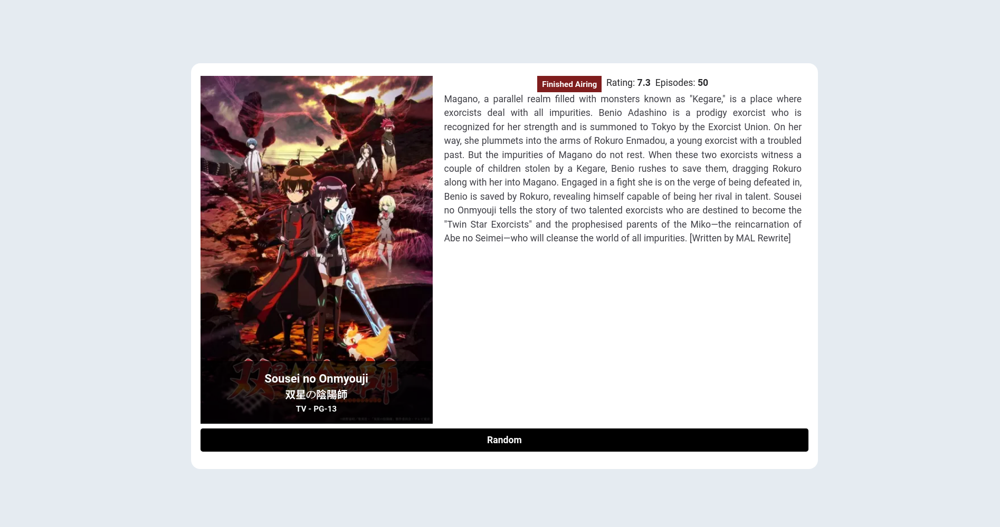
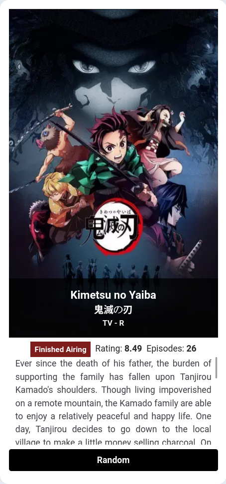

# MyAnimeSearch
A ideia do projeto é fazer um app web que puxa o endpoint da api jikan que responde com um anime aleatório do banco de dados do myanimelist. Essa api foi escolhida pois não é necessário ter uma api key para usá-la.

## Tecnologias 
As tecnologias utilizadas foram Reactjs para realizar o manuseio da DOM de maneira mais fácil, o Vite foi outra tecnologia utilizada para gerar um template de arquivos do projeto, assim como uma configuração para execução do projeto tanto no desenvolvimento quanto para gerar o código para produção. A ultima tecnologia adicionada foi o tailwindcss para permitir realizar mudanças css demaneira mais simples e rápida.

## *******Dificuldades*******
Encontrei duas dificuldades principais nesse projeto, a primeira delas foi o error handling da api, pois, não tinha noção do que a api retornava quando algum erro ocorria, consegui realizar o error handling para ocasiões em que o fetch da aplicação da erro, assim como um abort caso tenha várias requests seguidas. A segunda dificuldade foi na estilização do projeto, mais especificamente, na parte de responsividade e suporte para diferentes tamanhos de tela e a padronização no tamanho das imagens, que as vezes vem em tamanhos e proporções diferentes, e do conteúdo textual que também vinha em quantidades diferentes. O resultado final ficou agradável, porém, ainda há uma mudança mínima na largura das imagens no modo mobile e o site parece um pouco vázio.

## Imagens

## Possíveis Melhoras 
- Adicionar Dark Mode
- Adicionar mais informações sobre o anime, como por exemplo: Gênero, Reviews, Studio e Source. Isso requeriria uma mudança na estrutura do conteúdo.
